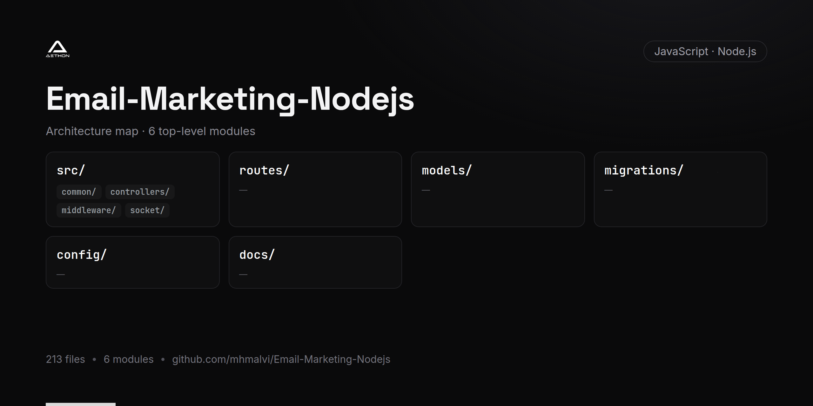

<!-- repo-card -->




# Email Marketing Platform

A full-featured email marketing backend built with Node.js and Express. The platform supports campaign management, contact list segmentation, email template design, scheduled sending via cron jobs, open/click tracking with pixel tracking, and Stripe-based subscription billing.

## Features

- **Campaign Management** -- Create, schedule, and send email campaigns with performance tracking
- **Contact Management** -- Import, organize, and segment contacts into groups
- **Email Templates** -- Design and manage reusable email templates with Handlebars
- **Scheduled Sending** -- Cron-based job scheduling for timed campaign delivery
- **Performance Analytics** -- Track open rates, click rates, and campaign performance metrics
- **Pixel Tracking** -- 1x1 pixel tracking for email open detection
- **Multiple Email Providers** -- Send via Gmail (App Passwords), AWS SES, and Nodemailer SMTP
- **Stripe Integration** -- Subscription plans, product management, and invoice generation
- **Sub-Admin Support** -- Delegate campaign management with sub-admin accounts
- **Google OAuth** -- Secure authentication via Google OAuth 2.0 with Passport.js
- **Email Validation** -- Deep email validation before sending to reduce bounce rates
- **Real-Time Notifications** -- Socket.IO powered real-time updates
- **Contact Us** -- Public-facing contact form for inquiries

## Tech Stack

- **Runtime:** Node.js
- **Framework:** Express.js
- **Database:** MySQL with Sequelize ORM
- **Template Engine:** Handlebars, EJS
- **Email:** Nodemailer, AWS SES
- **Authentication:** Passport.js (Google OAuth 2.0), bcrypt
- **Payments:** Stripe
- **Job Scheduling:** node-cron
- **Real-Time:** Socket.IO
- **Validation:** express-validator, deep-email-validator

## Prerequisites

- Node.js >= 14
- MySQL 5.7+
- Stripe account (for billing features)
- AWS account (for SES, optional)
- Google OAuth credentials

## Setup

1. **Clone the repository**
   ```bash
   git clone https://github.com/mhmalvi/Email-Marketing-Nodejs.git
   cd Email-Marketing-Nodejs
   ```

2. **Install dependencies**
   ```bash
   npm install
   ```

3. **Configure environment**
   ```bash
   cp .env.example .env
   ```

4. **Update `.env`** with the following:
   - MySQL database connection details
   - Stripe API keys
   - AWS SES credentials (optional)
   - Google OAuth client ID and secret
   - SMTP configuration

5. **Run database migrations**
   ```bash
   npx sequelize-cli db:migrate
   ```

6. **Start the development server**
   ```bash
   npm start
   ```

The server will start on the port defined in your environment configuration.

## Project Structure

```
src/
  controllers/     # Route handlers (Campaigns, Contacts, Auth, Stripe, etc.)
  middleware/       # Authentication and validation middleware
  socket/          # Socket.IO event handlers
  views/           # Handlebars email templates
  common/          # Shared utilities
models/            # Sequelize models (User, Contact, Campaign, Template, etc.)
routes/            # Express route definitions
config/            # Database config, constants, Passport setup
migrations/        # Sequelize migration files
public/            # Static assets
```

## License

ISC
